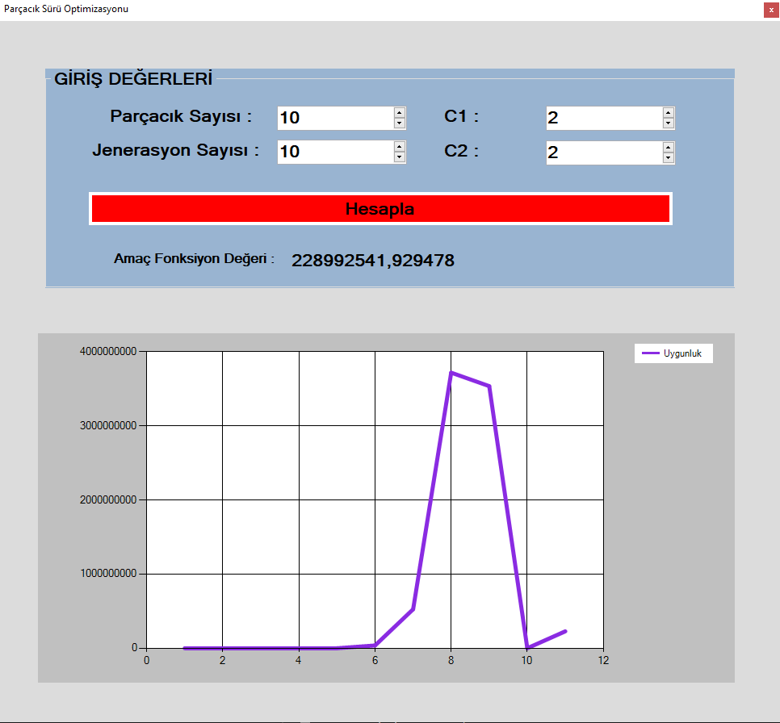

<h1 align="center">Parçacık Sürü Optimizasyonu  (Particle Swarm Optimization - PSO) Uygulaması</h1>

  

  <em>Bu depo, C# dilinde gerçekleştirilmiş bir Parçacık Sürü Optimizasyonu (PSO) uygulaması içermektedir. Uygulama, verilen bir fonksiyonu optimize etmek için PSO algoritmasını kullanmaktadır.</em>

## Özellikler

- **Kullanıcı Dostu Arayüz**: Parametreler (parçacık sayısı, jenerasyon sayısı, C1 ve C2 katsayıları) kolayca ayarlanabilir.
- **Gerçek Zamanlı Görselleştirme**: Algoritmanın ilerlemesiyle birlikte yakınsama grafiği dinamik olarak güncellenir.
- **Detaylı Sonuçlar**: En iyi çözümün parametre değerleri ve amaç fonksiyonu değeri kullanıcıya sunulur.

## Başlangıç

### Gereksinimler

- Visual Studio 2019 veya daha yenisi
- .NET Framework 4.7.2 veya daha yenisi

### Kurulum

1. Depoyu klonlayın:
git clone https://github.com/beyza-uzungel/YapayZeka_ParcacaikSuruOptimizasyonu.git
2. Visual Studio'da `pso_ai.sln` çözüm dosyasını açın.
3. Gerekli paketleri yükleyin ve çözümü derleyin.

### Kullanım

1. Uygulamayı çalıştırın.
2. Arayüz üzerinden parametreleri belirleyin:
- **Parçacık Sayısı**
- **Jenerasyon Sayısı**
- **C1 ve C2 Katsayıları**
3. "Hesapla" düğmesine tıklayarak optimizasyon sürecini başlatın.
4. Yakınsama grafiği canlı olarak izlenebilir, en iyi çözümün sonuçları anında görüntülenir.

## Algoritma Detayları

Parçacık Sürü Optimizasyonu (PSO), aday çözümlerin (parçacıkların) belirli kurallara göre hareket ederek bir amaç fonksiyonunu optimize ettiği bir meta-sezgisel optimizasyon tekniğidir.

### Amaç Fonksiyonu

Bu uygulamada kullanılan örnek amaç fonksiyonu:
\[ f(x, y) = (1 + (x + y + 1)^2 \cdot (19 - 14x + 3x^2 - 14y + 6xy + 3y^2)) \cdot (30 + (2x - 3y)^2 \cdot (18 - 32x + 12x^2 + 48y - 36xy + 27y^2)) \]

